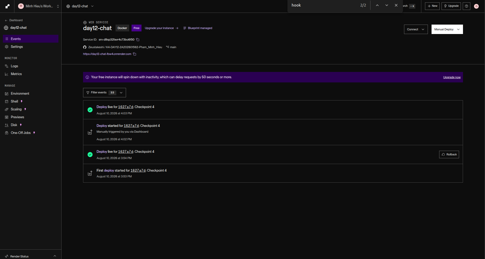
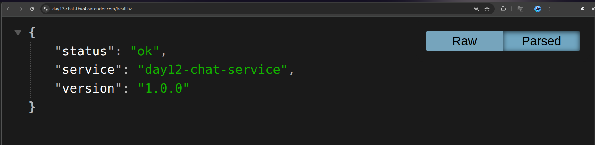

# Thông Tin Deploy — Checkpoint 5

> Điền file này sau khi deploy xong. `pytest tests/test_cp5.py` đọc file này
> để tìm địa chỉ service của bạn và gọi thử.
>
> **Chỉ ghi TÊN biến môi trường, tuyệt đối không dán giá trị token vào đây.**
> Repo này công khai — dán token vào là mất token.

## Thông Tin Học Viên

| Mục         | Nội dung                                                           |
| ----------- | ------------------------------------------------------------------ |
| Họ và tên   | Phạm Minh Hiếu                                                     |
| Mã học viên | 2A202601562                                                        |
| Repo        | https://github.com/Zeustakeshi/K4-DAY12-2A202601562-Pham_Minh_Hieu |

## Service

| Mục         | Nội dung                                                   |
| ----------- | ---------------------------------------------------------- |
| Public URL  | https://day12-chat-fbw4.onrender.com                       |
| Platform    | Render (Blueprint từ `render.yaml`, build từ `Dockerfile`) |
| Ngày deploy | 2026-08-10                                                 |

## Biến Môi Trường Đã Set Trên Cloud

Ghi tên biến và **nguồn giá trị**, không ghi giá trị:

| Biến                | Đã set | Ghi chú                                                                        |
| ------------------- | ------ | ------------------------------------------------------------------------------ |
| `PORT`              | ✅     | platform tự gán                                                                |
| `API_TOKEN`         | ✅     | nhập tay trong dashboard Render (`sync: false`), không nằm trong repo          |
| `REDIS_URL`         | ✅     | tự nối từ service Redis `day12-chat-redis` (`fromService` trong `render.yaml`) |
| `BUCKET_CAPACITY`   | ✅     | 10                                                                             |
| `REFILL_PER_MINUTE` | ✅     | 10                                                                             |
| `DAILY_BUDGET_USD`  | ✅     | 1.0                                                                            |
| `LOG_LEVEL`         | ✅     | INFO                                                                           |

## Lệnh Kiểm Tra

Thay `<URL>` bằng Public URL ở trên:

```bash
# 1. Liveness — mong đợi 200 {"status":"ok"}
curl -i https://day12-chat-fbw4.onrender.com/healthz

# 2. Readiness — mong đợi 200 {"status":"ready"} (đã nối được Redis)
curl -i https://day12-chat-fbw4.onrender.com/readyz

# 3. Không có token — mong đợi 401 kèm header WWW-Authenticate
curl -i -X POST https://day12-chat-fbw4.onrender.com/chat \
  -H "Content-Type: application/json" \
  -d '{"message":"Hello"}'

# 4. Có token — mong đợi 200 kèm câu trả lời
curl -i -X POST https://day12-chat-fbw4.onrender.com/chat \
  -H "Content-Type: application/json" \
  -H "Authorization: Bearer $API_TOKEN" \
  -H "X-Client-Id: sv-test" \
  -d '{"message":"Deploy là gì?"}'

# 5. Rate limit — gọi 15 lần, những lần cuối phải trả 429
for i in $(seq 1 15); do
  curl -s -o /dev/null -w "%{http_code} " -X POST <URL>/chat \
    -H "Content-Type: application/json" \
    -H "Authorization: Bearer $API_TOKEN" \
    -H "X-Client-Id: sv-test" \
    -d '{"message":"test"}'
done; echo
```

## Kết Quả Chạy Thật

```bash
$ curl -i https://day12-chat-fbw4.onrender.com/healthz
HTTP/2 200
{"status":"ok","service":"day12-chat-service","version":"1.0.0"}

$ curl -i https://day12-chat-fbw4.onrender.com/readyz
HTTP/2 200
{"status":"ready","redis":true}

$ curl -i -X POST https://day12-chat-fbw4.onrender.com/chat \
  -H "Content-Type: application/json" -d '{"message":"Hello"}'
HTTP/2 401
www-authenticate: Bearer
{"detail":"invalid or missing bearer token"}

$ curl -i -X POST https://day12-chat-fbw4.onrender.com/chat \
  -H "Content-Type: application/json" \
  -H "Authorization: Bearer $API_TOKEN" \
  -H "X-Client-Id: sv-test" \
  -d '{"message":"Deploy là gì?"}'
HTTP/2 200
{"reply":"Ngắn gọn: Deploy là gì phụ thuộc vào ba yếu tố — cấu hình qua biến
môi trường, health check để orchestrator biết trạng thái, và giới hạn tài
nguyên.","client_id":"sv-test","turns_before":0,"usd_cost":2.265e-05,
"usage":{"prompt":3,"completion":37}}

$ curl -i -X POST https://day12-chat-fbw4.onrender.com/chat \
  -H "Content-Type: application/json" \
  -H "Authorization: Bearer $API_TOKEN" \
  -H "X-Client-Id: sv-test" \
  -d '{"message":"chao"}'
HTTP/2 200
{"reply":"Câu hỏi hay. chao thường được giải quyết bằng cách chuẩn hóa môi
trường chạy: cùng một image chạy giống nhau ở laptop và trên cloud. (Mình
đang nhớ 2 lượt trao đổi trước đó.)","client_id":"sv-test","turns_before":2,
"usd_cost":3.195e-05,"usage":{"prompt":41,"completion":43}}
# turns_before: 2 -> lịch sử chat được đọc lại từ Redis giữa hai lần gọi,
# đúng bằng chứng cho việc service stateless (CP4)

$ for i in $(seq 1 15); do curl -s -o /dev/null -w "%{http_code} " \
    -X POST https://day12-chat-fbw4.onrender.com/chat \
    -H "Content-Type: application/json" \
    -H "Authorization: Bearer $API_TOKEN" \
    -H "X-Client-Id: rate-cloud-test" \
    -d '{"message":"test"}'; done; echo
200 200 200 200 200 200 200 200 200 200 429 429 429 429 429
# 10 request đầu qua (đúng bucket capacity mặc định = 10), từ request 11
# trở đi bị chặn 429 — token bucket hoạt động đúng trên môi trường cloud
```

## Ảnh Chụp Màn Hình

Đặt ảnh trong thư mục `screenshots/`:

- `screenshots/dashboard.png` — trang quản lý service trên platform



- `screenshots/healthz.png` — kết quả gọi `/healthz` từ trình duyệt hoặc curl


